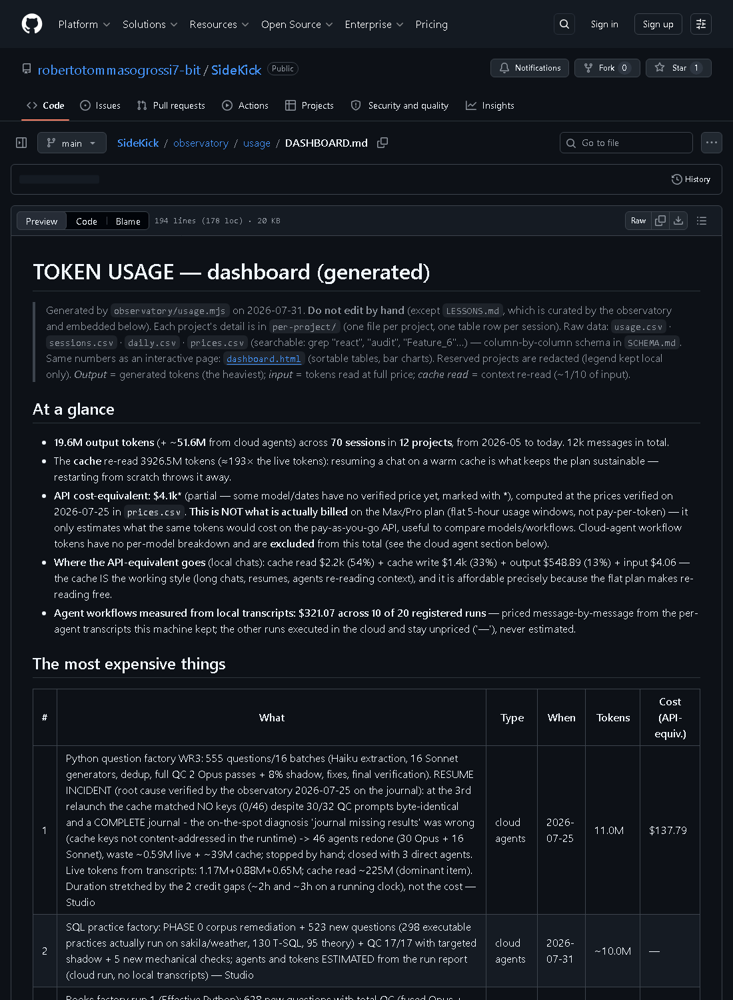
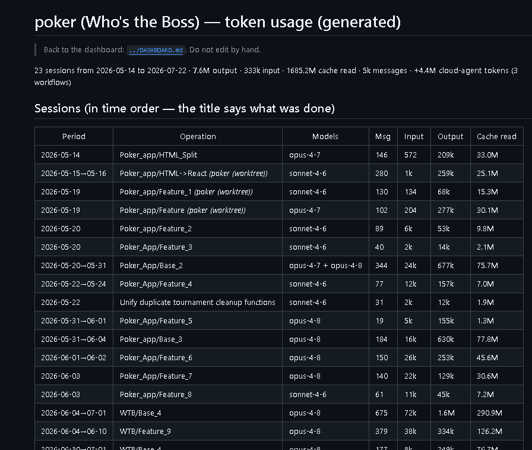

# SideKick — a real-world lab on building software with an AI coding agent

[](https://github.com/robertotommasogrossi7-bit/SideKick/actions/workflows/ci.yml)

🇮🇹 *Leggi in italiano: [ITALIANO/README.md](ITALIANO/README.md)*

**SideKick is where a real human+AI working method gets built, measured, and improved on
real numbers.** One beginner developer, several real apps, **every transcript measured**.
What it has produced so far:

- **A living working-method constitution — the spec of this repo**
  ([Italian master](plugins/metodo/COSTITUZIONE.md) ·
  [English](plugins/metodo/CONSTITUTION.md) · version and history in the
  [CHANGELOG](plugins/metodo/CHANGELOG.md); self-amending, with a Spec Kit drop-in +
  preset) that the AI applies proactively in every project.
- **A published, redacted dataset of real agent usage** — months of sessions with named
  operations and a hand-kept register of every cloud-agent workflow; live totals in the
  [dashboard](observatory/usage/DASHBOARD.md) (hand-copied numbers kept going stale here,
  so this page links them instead of repeating them). Plus the zero-dependency generator
  to rebuild the same dashboard from your own transcripts.
- **Measured wins**: heavy multi-agent audits found real critical bugs on both projects they
  ran on, before any user did (N=2); a mass-production "Factory" process generated 555
  verified study questions in one night with total QC and every solution executed for real.
- **Honest limits**: sample sizes stated next to every claim; negative results stay published
  ([FINDINGS.md](FINDINGS.md)).

Claude Code is the current instrument, not the point: the questions (what does each
collaboration choice cost and return?) apply to AI-assisted software engineering generally.

> **What this is:** first and foremost the author's own working lab — the data gets published
> because it may be useful, not because it's a product. Exploratory case studies with the
> sample sizes always stated (usually N=1–2). **What this is not:** benchmarks or proven best
> practices. Negative results are published on purpose.

## What you can take away

| Thing | Where | Why it's rare |
|---|---|---|
| **A published, redacted dataset of real agent usage** | [`observatory/usage/`](observatory/usage/) (CSV + dashboard), generated by [`observatory/usage.mjs`](observatory/usage.mjs) | Usage *tools* are plentiful — [ccusage](https://github.com/ryoppippi/ccusage) and its ecosystem analyze the same local JSONL transcripts, and do it with more features than our small script. What we publish that we have rarely seen elsewhere (*to our knowledge*) is the **data itself**: months of a real beginner's usage, session by session, with **named operations** (session titles like `WTB/Base_4` — WTB = Who's the Boss, one of the real apps, see the per-project drilldown), private projects redacted, plus a hand-kept register of cloud agent workflows — all in one dashboard, growing as long as local transcripts stay enabled. |
| **Cost meter for A/B experiment arms** | [`experiments/cost-meter.mjs`](experiments/cost-meter.mjs) | Measures turns/tokens of a with/without experiment from its transcripts. |
| **Leak-proof hidden-test grader** | [`experiments/streaming/oracle/`](experiments/streaming/oracle/) | Tests whether a process artifact helps, without revealing the answers to the model. |
| **The writeup** | [`FINDINGS.md`](FINDINGS.md) | *"I tried to measure whether captured process helps AI-assisted dev — and couldn't build a fair test (yet)."* Includes the contaminated first attempt and the external adversarial review that tore up v1. |
| **A Spec Kit constitution drop-in (+ tested preset)** | [`plugins/metodo/spec-kit/`](plugins/metodo/spec-kit/) | A self-amending working-method constitution in Spec Kit format (version in the file's footer, [amendment history](plugins/metodo/CHANGELOG.md)) — the depersonalized, reusable variant of our method; `preset.yml` seeds it at `specify init`, verified byte-identical. |

Quickstart for the dataset generator (no dependencies, Node 18+):

```
node observatory/usage.mjs
# reads ~/.claude/projects/**/*.jsonl (your local Claude Code transcripts)
# writes observatory/usage/: DASHBOARD.md (dashboard) + usage.csv + sessions.csv + per-project/
```

The committed [dashboard](observatory/usage/DASHBOARD.md) is exactly what the output looks like.

Heads-up when browsing the file tree: `experiments/` vendors the full app arms of the
with/without experiments (two third-party apps forked per arm — ~12MB, most of the repo's
bytes; explained in [`experiments/README.md`](experiments/README.md)). The lab's own
material lives in `observatory/` and `plugins/`.

## The lab (live data)

[](observatory/usage/DASHBOARD.md)

**[Open the live dashboard →](observatory/usage/DASHBOARD.md)** — totals at a glance and the
most expensive operations, regenerated from the real transcripts at every observatory review
(preview above refreshed 2026-07-25).

[`observatory/`](observatory/) is the observatory (English; Italian translation in
[`ITALIANO/`](ITALIANO/README.md)):

- [`usage/DASHBOARD.md`](observatory/usage/DASHBOARD.md) — the cost dashboard: totals, the
  most expensive operations, per-project drilldowns (one file per project).
- [`STRATEGIES.md`](observatory/STRATEGIES.md) — cost/benefit register of every working-method
  strategy under test: multi-agent audits, cross-model shadow checks, red teams, **including
  the strategies that failed and were dropped**.
- [`redteam/VERDICTS.md`](observatory/redteam/VERDICTS.md) — before this repo went public in
  its current form, two independent AI reviewers tore the dossier apart; the verdicts, the
  claim-by-claim verification (one reviewer "correction" turned out to be wrong), and the
  fixes are all in the open.
- [`DATA.md`](observatory/DATA.md) / [`PLAN.md`](observatory/PLAN.md) — what the data can
  and cannot say yet, and what's next.
- [`AUDIT-REPO-2026-07-25.md`](observatory/AUDIT-REPO-2026-07-25.md) — a 24-agent audit of
  this very repo (14 confirmed findings, all fixed the same day — outcome inside).

Every project gets its own drilldown — here is a real app's build history, session by
session, named operation by named operation:

[](observatory/usage/per-project/poker-who-s-the-boss.md)

**[a real app's per-session table →](observatory/usage/per-project/poker-who-s-the-boss.md)**

A few sample findings (details and caveats inside): a heavy multi-agent audit found real
critical bugs on both projects it ran on, at a known cost (N=2); across the cross-model
shadow experiments (N=4, incl. a 54-pair batch) small and large models tied on **code**
verification — on process/config findings the higher model falsifies better — an indication
we keep testing, not a trend; cache reads were ~187× the live tokens across all chats (2026-07-25
count; ~170× at the prior one — a gauge of how much long chats re-read their context at every
message) — our operating rule ("resume interrupted work instead of restarting") comes from
that mechanic plus one measured resume that reused 100% of completed steps, not from an A/B
test.

## The method — the spec of this repo (operating hypotheses, not proven rules)

We also maintain a **working-method constitution** for human+AI collaboration: idea capture,
design-before-code, research-before-choosing, model+effort per step, a "data contract" so
every chat leaves measurable traces. It lives in [`plugins/metodo/`](plugins/metodo/)
(Italian master · English version · Spec Kit drop-in) and is **self-amending**: the method is
expected to change as the data comes in. Every rule in it is an operating hypothesis backed
by small N.

To use it: copy [`plugins/metodo/COSTITUZIONE.md`](plugins/metodo/COSTITUZIONE.md) (or the
[English version](plugins/metodo/CONSTITUTION.md)) into your `~/.claude/CLAUDE.md`, or drop
the [Spec Kit constitution](plugins/metodo/spec-kit/constitution.md) into
`.specify/memory/constitution.md`.

Relation to [GitHub Spec Kit](https://github.com/github/spec-kit): Spec Kit organizes the
*work* (constitution → spec → plan → tasks); SideKick measures the *collaboration* — what
each method choice costs and returns — and ships its method as a Spec Kit constitution
drop-in.

## Where this started (and what we still can't claim)

*"I tried to measure whether captured process helps AI-assisted dev — and couldn't build a
fair test (yet)."* — [the writeup this repo grew out of](FINDINGS.md). That first measurement
failed honestly (contaminated arms, N too small to mean anything) and it stays published: it
is the reason the observatory exists. What we *can* show today is above; what we still can't
claim is spelled out in FINDINGS.md.

## Honesty rules of this repo

1. Sample sizes stated next to every claim; small N is called an *indication*, never proof.
2. Negative results and dropped strategies stay published (`FINDINGS.md`, the raw Italian
   logs preserved in this repo's git history, the "dropped" section of `STRATEGIES.md`).
3. Anything public goes through an external AI red team first — and the reviewers' claims get
   verified at the source too (they're sometimes wrong).

## Italiano

La versione italiana della documentazione principale è in [`ITALIANO/`](ITALIANO/README.md):
una copia esatta ma tradotta del repository, tenuta in sync a ogni revisione
dell'osservatorio. (Gli originali italiani storici, pre-2026-07-25, restano nella
cronologia git.)

## License

[MIT](LICENSE)
