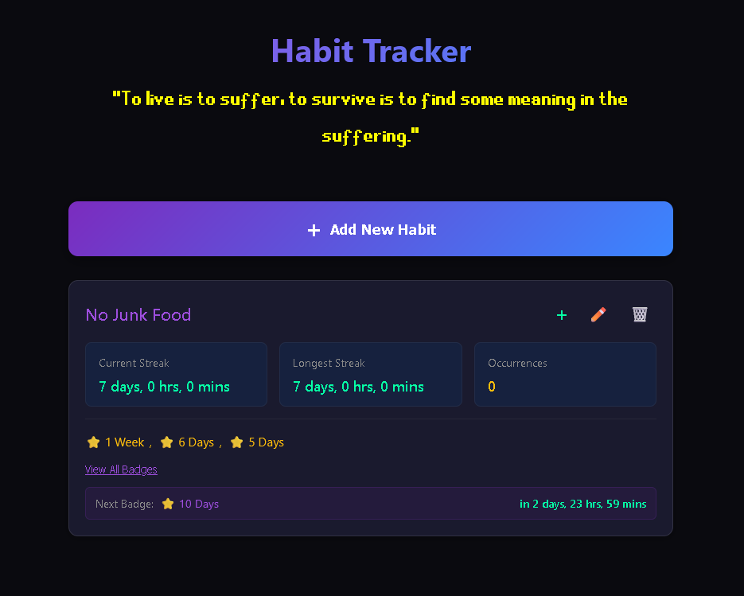
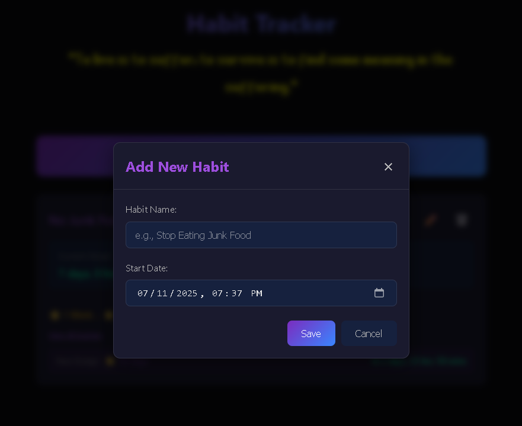
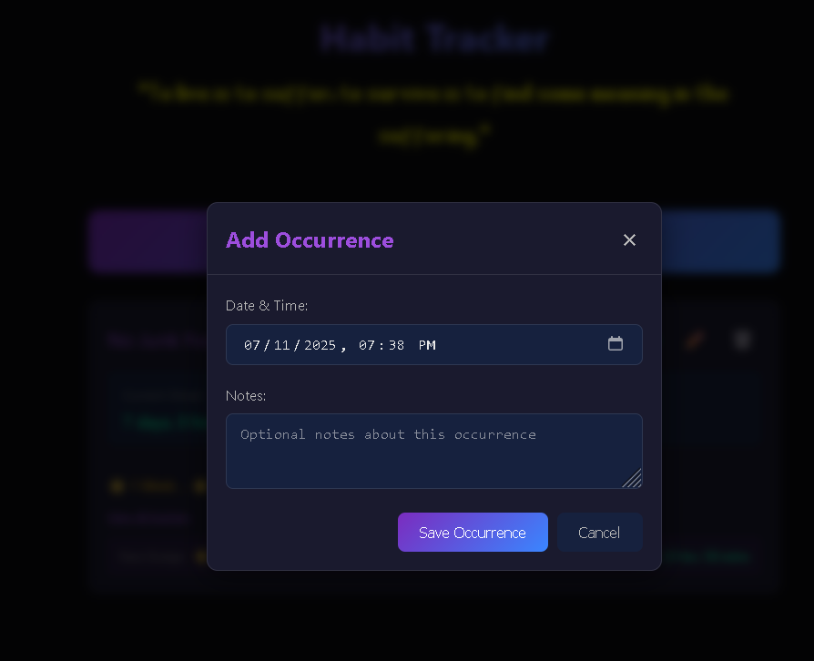
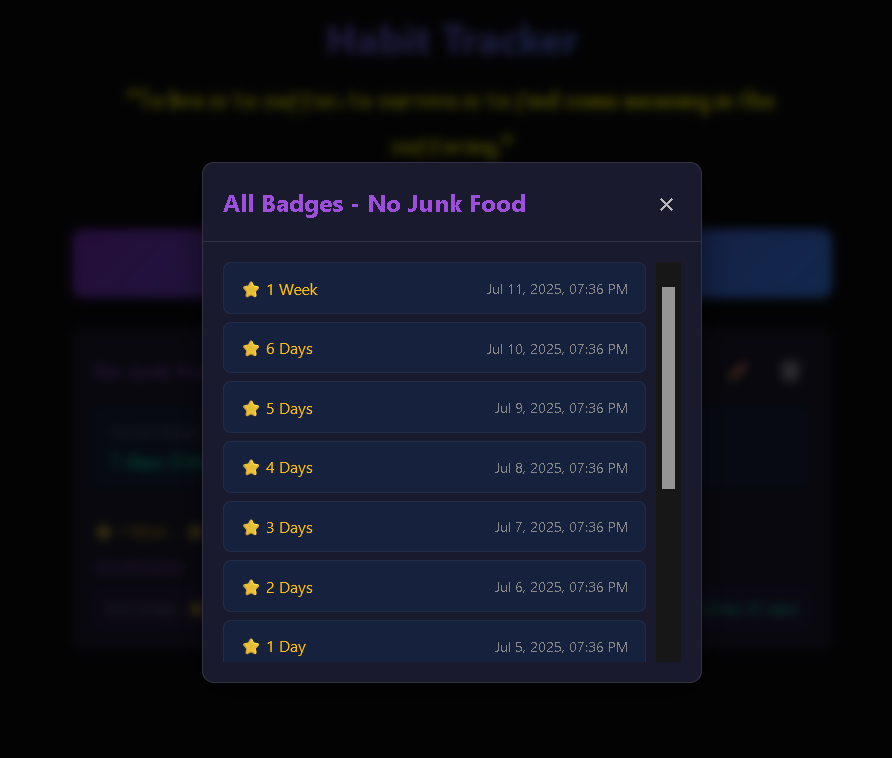

# Habit Tracker

A minimalist, self-hosted habit tracking application with a gamified badge system to help you break bad habits and build positive ones.


## Features

- **Simple Habit Tracking**: Track any habit with customizable start dates
- **Occurrence Management**: Record when habits occur with optional notes and delete individual occurrences
- **Gamified Experience**: Earn badges for streak milestones (1 hour to 2+ years)
- **Real-time Streak Calculation**: Live updates of current and longest streaks
- **Data Backup & Restore**: Export and import your habit data as JSON files
- **Dark Theme**: Easy on the eyes with a modern, cyberpunk-inspired design
- **Responsive Design**: Works seamlessly on desktop and mobile devices
- **Local Storage**: All data stored in your browser - no external dependencies
- **Self-Hosted**: Run it anywhere with Docker

## Screenshot

### Main Interface


### Adding a New Habit


### Track Occurences


### Badge System


## Getting Started

### Prerequisites

- [Docker](https://docs.docker.com/get-docker/) and [Docker Compose](https://docs.docker.com/compose/install/)

### Installation

1. Clone the repository
```bash
git clone https://github.com/justind-dev/habit-tracker.git
cd habit-tracker
```

2. Start the application with Docker Compose
```bash
docker compose up -d
```

3. Open your browser and navigate to `http://localhost:8080`

That's it! Your habit tracker is now running locally.

### Stopping the Application

```bash
docker compose down
```

## Usage

### Adding a Habit
1. Click the "Add New Habit" button
2. Enter a descriptive name (e.g., "Stop Eating Junk Food")
3. Set your start date and time
4. Click "Save"

### Tracking Occurrences
- Click the "+" button on any habit card to log when the habit occurred
- Add optional notes to provide context
- The app will automatically recalculate your streaks and badges
- From this pop-up you can also see existing occurrences as well as a '🗑️' for deleting them

### Badge System
Earn badges for maintaining streaks:
- **Short-term**: 1 hour, 3 hours, 6 hours, 12 hours
- **Daily**: 1-6 days, 1-3 weeks  
- **Long-term**: 1+ months, 50+ days, 1+ years

### Adding Custom Badges

Add custom badge images (128x128 PNG) to `web/images/` using the naming pattern: `badge_[duration]_image.png`

Examples: `badge_1hour_image.png`, `badge_1day_image.png`, `badge_1week_image.png`

#### Adding New Milestones
1. Add image to `web/images/` following naming convention
2. Add entry to `BADGE_DEFINITIONS` in `web/app.js`:
```javascript
{ id: '3month', name: '3 Months', milliseconds: 7776000000 }
```
3. App automatically uses custom image or falls back to 🔥 emoji

Images display at 32x32 in cards, 96x96 in badge modal.

### Managing Habits
- **Edit**: Click the pencil icon to modify habit details
- **Delete**: Click the trash icon to permanently remove a habit
- **View All Badges**: Click "View All Badges" to see your complete achievement history

### Data Management
- **Export**: Click "Export Data" to download a JSON backup file
- **Import**: Click "Import Data" to restore from a backup file
- Backup files include all habits, occurrences, and earned badges
- Import will replace current data (backup recommended first)

## Technical Details

### Architecture
- **Frontend**: Vanilla JavaScript, HTML5, CSS3
- **Backend**: Static files served by nginx
- **Storage**: Browser localStorage (client-side only)
- **Deployment**: Docker container with nginx:alpine

### Data Storage
All habit data is stored locally in your browser's localStorage. This means:
- ✅ Complete privacy - no data leaves your device
- ✅ No server costs or maintenance
- ⚠️ Data is tied to your specific browser/device
- ⚠️ Clearing browser data will reset the app

### Port Configuration
The application runs on port 8080 by default. To change this, modify the `docker-compose.yml` file:

```yaml
ports:
  - "YOUR_PORT:80"
```

## Development

### Local Development Without Docker

1. Clone the repository
2. Serve the `web/` directory with any static file server:

```bash
# Using Python
cd web
python -m http.server 8080

# Using Node.js serve
npx serve web -p 8080

# Using PHP
cd web
php -S localhost:8080
```

### File Structure
```
├── web/
│   ├── index.html          # Main application HTML
│   ├── app.js             # Core application logic
│   ├── styles.css         # Styling and theme
│   ├── robots.txt         # Bot exclusions
│   └── favicon.ico        # Favicon, replace with your own
├── docker-compose.yml     # Docker deployment config
└── LICENSE               # GPL v3 License
```

## Contributing

1. Fork the repository
2. Create a feature branch (`git checkout -b feature/amazing-feature`)
3. Commit your changes (`git commit -m 'Add amazing feature'`)
4. Push to the branch (`git push origin feature/amazing-feature`)
5. Open a Pull Request

## License

This project is licensed under the GNU General Public License v3.0 - see the [LICENSE](LICENSE) file for details.

## Acknowledgments

- Inspired by habit tracking psychology and gamification principles
- Dark theme design influenced by cyberpunk aesthetics
- Built with accessibility and mobile-first principles

## Support

If you encounter any issues or have feature requests, please [open an issue](https://github.com/justind-dev/habit-tracker/issues) on GitHub.

---

*"To live is to suffer, to survive is to find some meaning in the suffering."*
